### Installing Datadog Agent
For this exercise, I have installed the the datadog-agent on Mac OS X using this command given in the [installation instructions](https://app.datadoghq.com/signup/agent#mac) after signing up for my datadog account:

~~~
DD_API_KEY=<MY-API-KEY> bash -c "$(curl -L https://raw.githubusercontent.com/DataDog/datadog-agent/master/cmd/agent/install_mac_os.sh)"
~~~

Once installed you should be able to open the Datadog Agent through the system tray. (cmd + space > Search datadog agent)

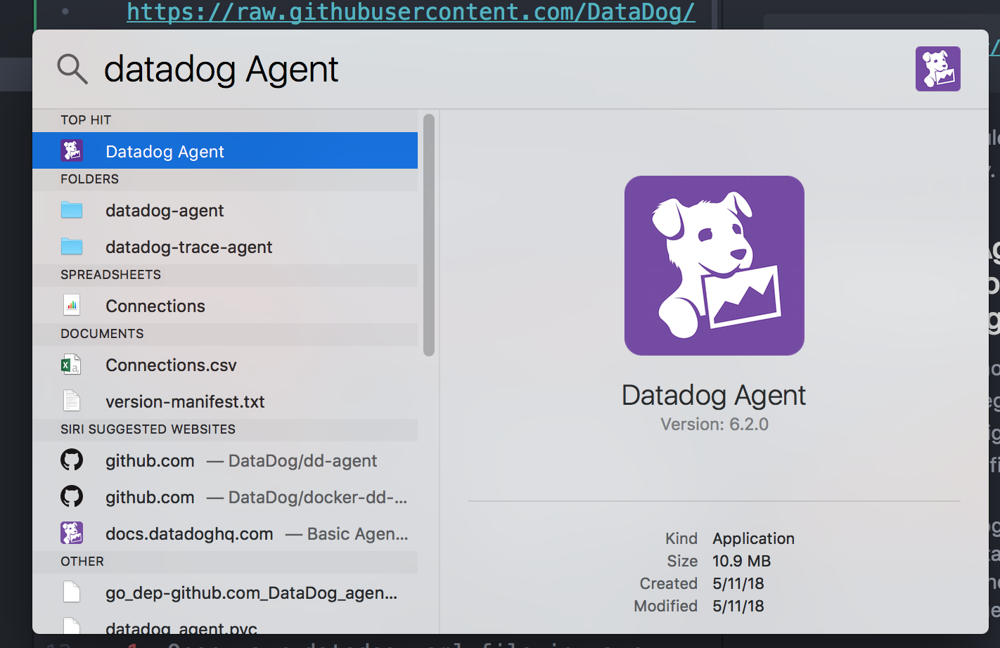

### Q: Add tags in the Agent config file and show us a screenshot of your host and its tags on the Host Map page in Datadog.

There are multiple methods of applying tags to your host including the use of integrations, the Datadog UI, the Datadog API, and your host configuration file. In order to assign a tag using the configuration file you must:

1. Open your datadog.yaml file in your text editor
2. Add tags to your tag dictionary following the required syntax shown in the [Datadog Documentation](https://docs.datadoghq.com/getting_started/tagging/assigning_tags/). Here we are using key:value tags.

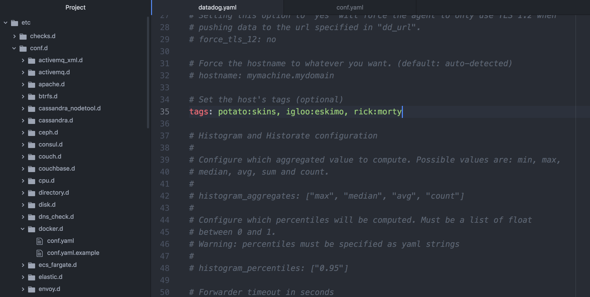
3. Reset your Agent from your terminal using the following lines
~~~
datadog-agent start
datadog-agent stop
~~~

*Before accessing the hostmap, you may be prompted to enable WebGl if you are using Google Chrome. You can enable WebGL by*:

1. Typing [chrome://flags/](chrome://flags/) in the adress bar and hitting enter
2. Click enable under _WebGL Draft Extensions_
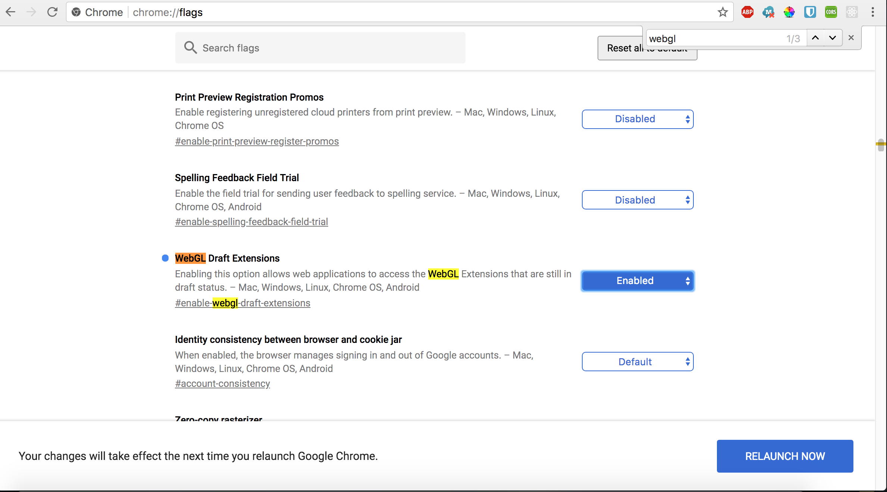

On the [host map page](https://app.datadoghq.com/infrastructure/map), you will see the tags assigned to your host by clicking on the hexagon representing your host.
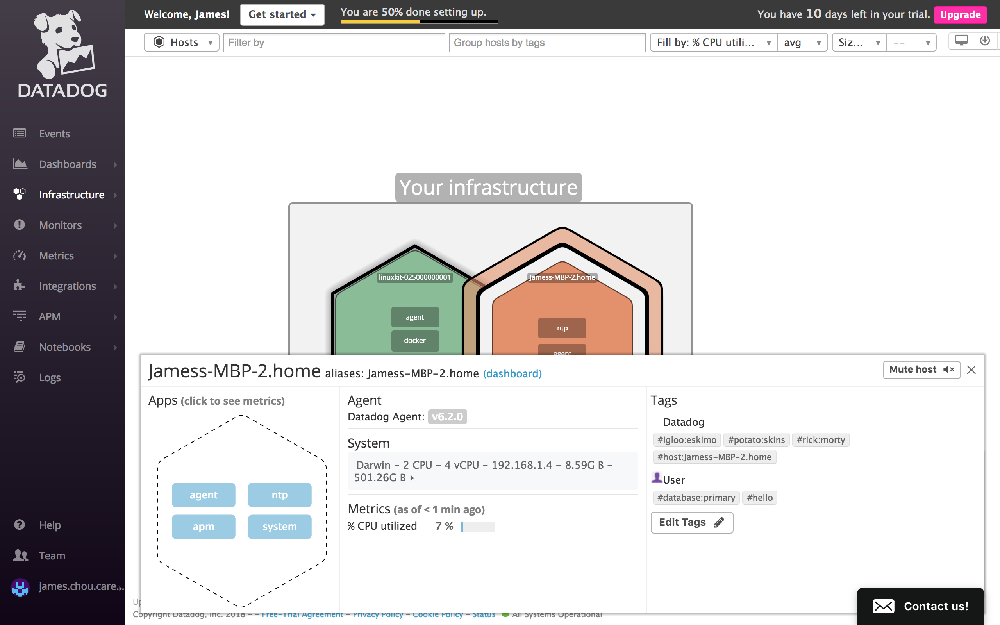

### Q: Install a database on your machine (MongoDB, MySQL, or PostgreSQL) and then install the respective Datadog integration for that database.

For this question I decided to install the PostgreSQL integration as most of the applications I make utilize Postgres already.

1. Click on the integrations tab from the top navbar of the Datadog app and search for `postgresql` to find the PostgreSQL integration.

2. Click __Install__ and follow the steps under the Configuration tab of the modal that pops-up.

  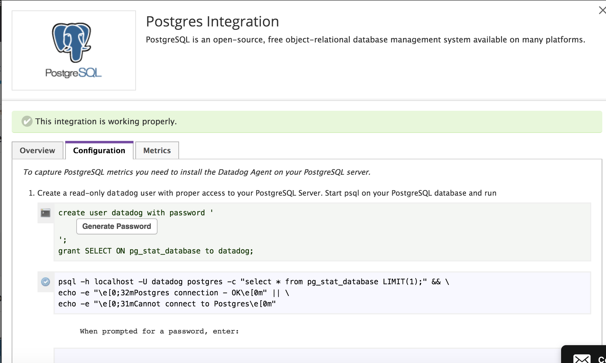
 - Generate your password and and run `psql` in your terminal (if you run into any issues with your postgresql database, refer to [this link](https://www.digitalocean.com/community/tutorials/how-to-use-roles-and-manage-grant-permissions-in-postgresql-on-a-vps--2#how-to-delete-roles-in-postgresqlhttps://www.digitalocean.com/community/tutorials/how-to-use-roles-and-manage-grant-permissions-in-postgresql-on-a-vps--2#how-to-delete-roles-in-postgresql) as you may need to create your database or complete initial setup)
 - Run step 1 of the configuration in your terminal.
 ~~~
 create user datadog with password <GENERATED-PASSWORD>;
grant SELECT ON pg_stat_database to datadog;
 ~~~
 - You can also test that the user has been successfully created with
 ~~~
 psql -h localhost -U datadog postgres -c "select * from pg_stat_database LIMIT(1);" && \
echo -e "\e[0;32mPostgres connection - OK\e[0m" || \
echo -e "\e[0;31mCannot connect to Postgres\e[0m"
 ~~~
 You should be prompted for your password

 - Create a `conf.yaml` file in your `postgres.d` directory and add the code below (copied from conf.yaml.example in the same folder)

  ~~~
   init_config:

  instances:
     -   host: localhost
         port: 5432
         username: datadog
         password: <GENERATED-PASSWORD>

   ~~~

- Restart your agent and run `datadog-agent status` to make sure your integration is successfully executing. You should see something like this:

  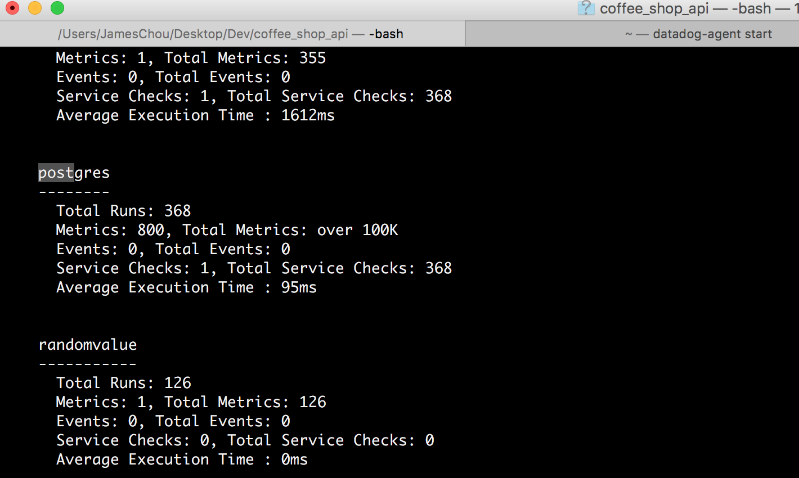

### Q: Create a custom Agent check that submits a metric named my_metric with a random value between 0 and 1000.

In order to create an agent check, we need to create a .yaml file in our conf.d directory and a .py file in our checks.d directory (both files need to share the same name). In this example, I have created `randomvalue.yaml` and `randomvalue.py`

First we should test if the agent check is running properly by having it submit a simple metric. Here I used the check provided in the Datadog documentation:

__randomvalue.py__
~~~
from checks import AgentCheck
class HelloCheck(AgentCheck):
    def check(self, instance):
        self.gauge('hello.world', 1)
~~~

__randomvalue.yaml__
~~~
init_config:

instances:
    [{}]
~~~

Now, if you run `datadog-agent check <check-name>` in your terminal, you should see something like this:

~~~
~/.datadog-agent $ datadog-agent check randomvalue
=== Series ===
{
  "series": [
    {
      "metric": "hello.world",
      "points": [
        [
          1527821909,
          1
        ]
      ],
      "tags": null,
      "host": "Jamess-MBP-2.home",
      "type": "gauge",
      "interval": 0,
      "source_type_name": "System"
    }
  ]
}
=========
Collector
=========

  Running Checks
  ==============
    randomvalue
    -----------
      Total Runs: 1
      Metrics: 1, Total Metrics: 1
      Events: 0, Total Events: 0
      Service Checks: 0, Total Service Checks: 0
      Average Execution Time : 0ms

  Config Errors
  ==============
    docker
    ------
      Configuration file contains no valid instances

  Loading Errors
  ==============
    apm
    ---
      Core Check Loader:
        Could not configure check APM Agent: APM agent disabled through main configuration file

      JMX Check Loader:
        check is not a jmx check, or unable to determine if it's so

      Python Check Loader:
        No module named apm

Check has run only once, if some metrics are missing you can try again with --check-rate to see any other metric if available.

~~~

In order to configure our agent check to pass a random number instead of just the same number each time, we will use the `random` python package in our `randomvalue.py` to use the `randinit()` method.

__randomvalue.py__
~~~
from checks import AgentCheck

import random

class HelloCheck(AgentCheck):
    def check(self, instance):
        self.gauge('hello.world', random.randint(0,1001))
~~~

 Before testing the agent check again, we will also need to install the `random` package using pip which is embedded in the datadog agent application. In my terminal I ran:

`sudo /opt/datadog-agent/embedded/bin/pip install random`

From here, you should restart your agent and run `datadog-agent check randomvalue` again to see that the metric is submitting a random number between 0 and 1000 each time.

__I was unable to get this agent check to run after introducing the `import random` line in my `randomvalue.py` file. I saw that I was unable to restart my agent after attempting to import the module and received a lengthy error in my terminal after `datadog-agent start`. These were the steps I used to troubleshoot my issue.__

__datadog-agent status__

~~~
randomvalue
   -----------
     Total Runs: 294
     Metrics: 0, Total Metrics: 0
     Events: 0, Total Events: 0
     Service Checks: 0, Total Service Checks: 0
     Average Execution Time : 0ms
     Error: global name 'random' is not defined
     Traceback (most recent call last):
       File "/opt/datadog-agent/bin/agent/dist/checks/__init__.py", line 332, in run
         self.check(copy.deepcopy(self.instances[0]))
       File "/opt/datadog-agent/etc/checks.d/randomvalue.py", line 5, in check
         self.gauge('hello.world', random.randint(0,1001))
     NameError: global name 'random' is not defined
~~~

__Troubleshooting__
------
 1. I tried importing other python packages like `faker` and `Numpy` to make sure that this issue was not specific to the `random` package. I also learned that the `random` package typically comes pre-installed in any up-to-date Python library. Importing these packages all produced the same error
 2. Since I am relatively new to python, I thought my problem could be with my syntax. I tried my code in terminal by running `python` and `import random`. The randint(0,1000) consistently produced a random number in console so I concluded that it must be an issue with my machine or agent.
 2. Although unlikely, I tried to resolve the issue by installing Go on my machine since the error seemed to be Go related.
 3. I checked the datadog documentation as well as the github page for similar cases of this issue but found no results.
 4. I reinstalled the datadog agent and repeated my steps but still received the same error

-----

### Q: Change your check's collection interval so that it only submits the metric once every 45 seconds.

The collection interval is configured on the instance level. For our instance of `number` we can add the line `min_collection_interval: 45` to set our collection interval to 45 seconds.

~~~
init_config:

instances:
  - number: 123
    min_collection_interval: 45

~~~

### Q: Utilize the Datadog API to create a Timeboard that contains:

#### Q: Your custom metric scoped over your host.
To create my timeboard using the API I referred to the [API Docs](https://docs.datadoghq.com/api/?lang=ruby#timeboards) and wrote my script in ruby. Adjusting the sample provided in the docs, I created a timeboard including a graph for my_metric. To adjust this for your metric, change your app-key, api-key, and your query (`"q" =>`) call your metric.

~~~
require 'rubygems'
require 'dogapi'

api_key = '<API-Key>'
app_key = '<APP-KEY>'

dog = Dogapi::Client.new(api_key, app_key)

# Create a timeboard for PostgreSQL commits.
title = 'J Dashbord'
description = 'And they are marvelous.'
graphs = [
{
    "definition" => {
        "events" => [],
        "requests" => [{
            "q" => "avg:my_metric{*} by {host}"
        }],
        "viz" => "timeseries"
    },
    "title" => "My Metric"
}]

template_variables = [{
    "name" => "host1",
    "prefix" => "host",
    "default" => "host:my-host"
}]

#Create anomaly function

tags = ['app:webserver', 'frontend']

dog.create_dashboard(title, description, graphs, template_variables)

~~~

#### Q: Any metric from the Integration on your Database with the anomaly function applied.

For our integration metric, I have selected the postgres.commits metric. We can add a second graph in our `graphs` array and change the title and query to visualize our database commit data.

~~~~
graphs = [
{
    "definition" => {
        "events" => [],
        "requests" => [{
            "q" => "avg:my_metric{*} by {host}"
        }],
        "viz" => "timeseries"
    },
    "title" => "My Metric"
},
{
    "definition" => {
        "events" => [],
        "requests" => [{
            "q" => "avg:postgresql.commits{*}"
        }],
        "viz" => "timeseries"
    },
    "title" => "PostgreSQL Commits"
}]
~~~~

In order to add the anomaly function to our metric, we need to add a monitor. Again, I copied the sample API request to post a monitor and modified the code to use the anomaly function. To create a monitor, we will also need to provide `options` as shown in the snippet below

~~~
#Create anomaly function
options = {
    'notify_no_data' => true,
    'no_data_timeframe' => 20
}
tags = ['app:webserver', 'frontend']
dog.monitor("metric alert", "avg(last_4h):anomalies(avg:postgresql.commits{*}, 'basic', 2, direction='both', alert_window='last_5m', interval=60, count_default_zero='true') >= 1", : name => "Postgres commits", :message => "More commits than usual", : tags => tags, : options => options)

~~~

__Note__: *The structure of the monitor:
`dog.monitor(type, query, name, tag, options)` and the structure of the query can differ depending on the type. [More info on queries in API requests](https://docs.datadoghq.com/api/?lang=ruby#create-a-monitor)*

#### Q: Your custom metric with the rollup function applied to sum up all the points for the past hour into one bucket

And we can create another monitor for our custom metric by requesting a similar monitor but changing the query to specify the sum of all the points for `my_metric` in the past hour
~~~
dog.monitor("metric alert", "avg(last_1h):anomalies(avg:my_metric{*} by {host}, 'basic', 2, direction='both', alert_window='last_5m', interval=60, count_default_zero='true').rollup(sum,60) >= 1", :name => "My_Metric", :message => "Sum of points", :tags => tags, :options => options)
~~~

Here's a look at my entire script for this question

__timeboard.rb__
~~~
require 'rubygems'
require 'dogapi'

api_key = '1f8f9c8b283982298fc39533f951ed42'
app_key = '50fc9afa5aa224b37e4ced97a08068cc831dc2d3'

dog = Dogapi::Client.new(api_key, app_key)

# Create a timeboard for PostgreSQL commits.
title = 'J Dashbord'
description = 'And they are marvelous.'
graphs = [
{
    "definition" => {
        "events" => [],
        "requests" => [{
            "q" => "avg:my_metric{*} by {host}"
        }],
        "viz" => "timeseries"
    },
    "title" => "Graph 1"
},
{
    "definition" => {
        "events" => [],
        "requests" => [{
            "q" => "avg:postgresql.commits{*}"
        }],
        "viz" => "timeseries"
    },
    "title" => "Graph 2"
}]
template_variables = [{
    "name" => "host1",
    "prefix" => "host",
    "default" => "host:my-host"
}]

#Create anomaly function
options = {
    'notify_no_data' => true,
    'no_data_timeframe' => 10
}
tags = ['app:webserver', 'frontend']
dog.monitor("metric alert", "avg(last_4h):anomalies(avg:postgresql.commits{*}, 'basic', 2, direction='both', alert_window='last_5m', interval=60, count_default_zero='true') >= 1", :name => "Postgres commits", :message => "More commits than usual", :tags => tags, :options => options)
dog.monitor("metric alert", "avg(last_4h):anomalies(avg:my_metric{*} by {host}, 'basic', 2, direction='both', alert_window='last_5m', interval=60, count_default_zero='true').rollup(sum,60) >= 1", :name => "My_Metric", :message => "Sum", :tags => tags, :options => options)
dog.monitor("metric alert", "avg(last_5m):avg:my_metric{*} > 800", :name => "J-Alert", :message => "{{#is_alert}} Alert over 800!{{/is_alert}} }} {{#is_warning}}Warning over 500!{{/is_warning}} {{#is_no_data}}No Data Alert{{/is_no_data}} @james.chou.career@gmail.com", :tags => tags, :options => {'notify_no_data' => true, 'no_data_timeframe' => 10, 'critical' => 800, 'warning' => 500})
dog.create_dashboard(title, description, graphs, template_variables)

~~~

And now I can see the dashboard I created from my script in the UI:

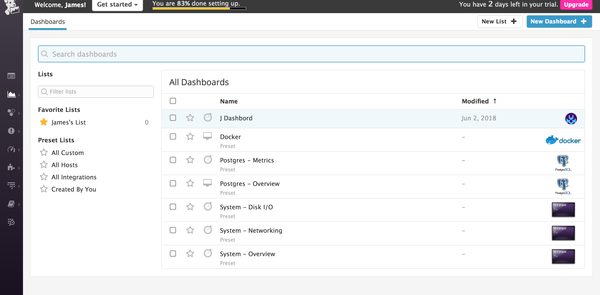

#### Q: Once this is created, access the Dashboard from your Dashboard List in the UI:

- Set the Timeboard's timeframe to the past 5 minutes

 *At this time I could not find any documentation on how to set the timeframe for the timeboard in the API or in UI from the documentation. The timeframe seems to be limited to the past hour as the shortest duration. Again, I checked the github for the agent to see if there were recent changes to the UI.*

- q: Take a snapshot of this graph and use the @ notation to send it to yourself.

  Clicking the camera icon will allow you to snapshot and send my graph to yourself.
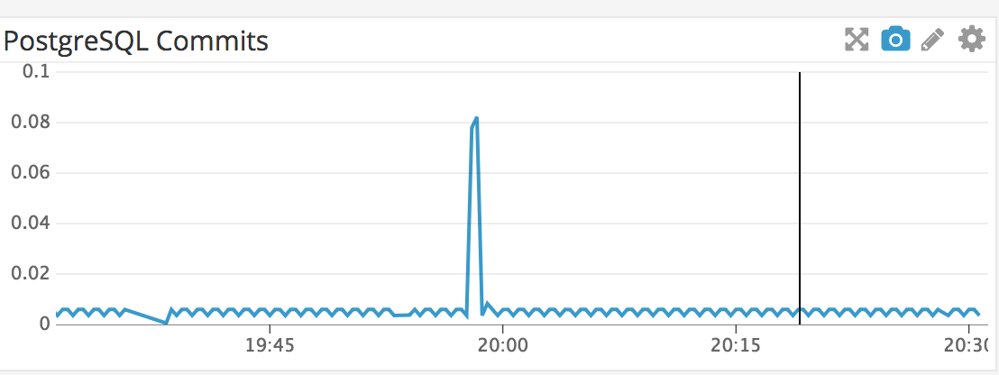

  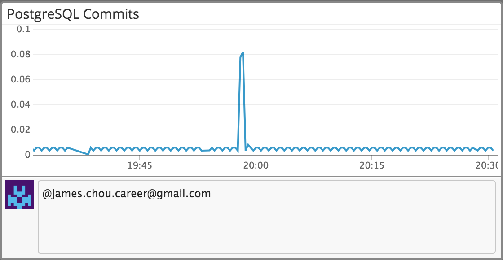
- Bonus Question: What is the Anomaly graph displaying?

  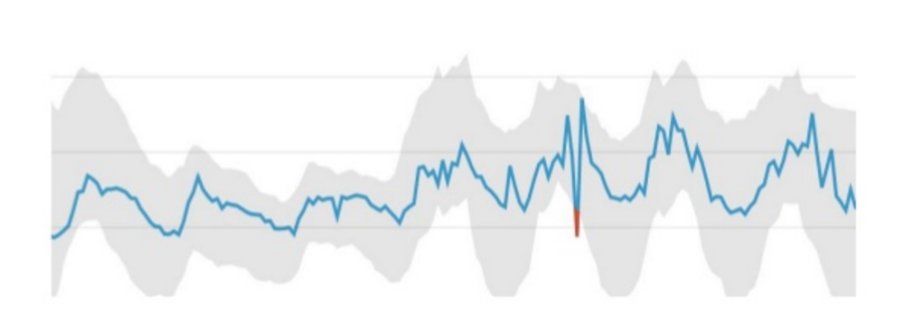
  The anomaly graph displays a certain metric overtime and it's historical trends. The graph shows it's predicted trend(grey) and highlights any abnormal behavior that lies outside of the the trend(red).

#### Q: Since you’ve already caught your test metric going above 800 once, you don’t want to have to continually watch this dashboard to be alerted when it goes above 800 again. So let’s make life easier by creating a monitor.

Due to my trouble creating the random agent check metric, I chose to trigger the alert by setting the metric to continuously submit a specific number between 500 and 800 for a warning message and above 800 for an alert message.
#### Q: Create a new Metric Monitor that watches the average of your custom metric (my_metric) and will alert if it’s above the following values over the past 5 minutes:

 - __Warning threshold of 500__
 - __Alerting threshold of 800__
 - __And also ensure that it will notify you if there is  No Data for this query over the past 10m.__

 In my ruby file `monitor.rb`, I added a line to create a new monitor with these settings:

 __type__:
 `"metric alert"`

 __query__:
 We can only specify our alert threshold in our query and warning thresholds must be specified in options as shown in the next snippet
  `"avg(last_5m):avg:my_metric{*} > 800"`

 __options:__
 We can specify the timeframe of our no-data alert as well as our warning threshold
 `{'notify_no_data' => true, 'no_data_timeframe' => 10, 'critical' => 800, 'warning' => 500}`

 __Put all together__:
 ~~~
 dog.monitor("metric alert", "avg(last_5m):avg:my_metric{*} > 800", :name => "J-Alert", :message => "Hi this is a message", :tags => tags, :options => {'notify_no_data' => true, 'no_data_timeframe' => 10, 'critical' => 800, 'warning' => 500})

 ~~~

 - __Please configure the monitor’s message so that it will__

   - Send you an email whenever the monitor triggers.
   - Create different messages based on whether the monitor is in an Alert, Warning, or No Data state.
   - Include the metric value that caused the monitor to trigger and host ip when the Monitor triggers an Alert state.
   - When this monitor sends you an email notification, take a screenshot of the email that it sends you.

    For our alert emails, we will need to edit the `message` value of our API request. We can use @ to specify which email should recieve these notifications as well __(I learned to create separate alert, warning, and no-data messages through creating a monitor using the UI before creating the same monitor through API request)__:

    ~~~
    "{{#is_alert}} Alert over 800!{{/is_alert}} }} {{#is_warning}}Warning over 500!{{/is_warning}} {{#is_no_data}}No Data Alert{{/is_no_data}} @james.chou.career@gmail.com"    
    ~~~

    I ran my API request through the terminal `ruby monitor.rb` and checked my UI to see that my monitors were successfully created.

    

    I also see that I received an alert shortly after when my metric submitted over 800

    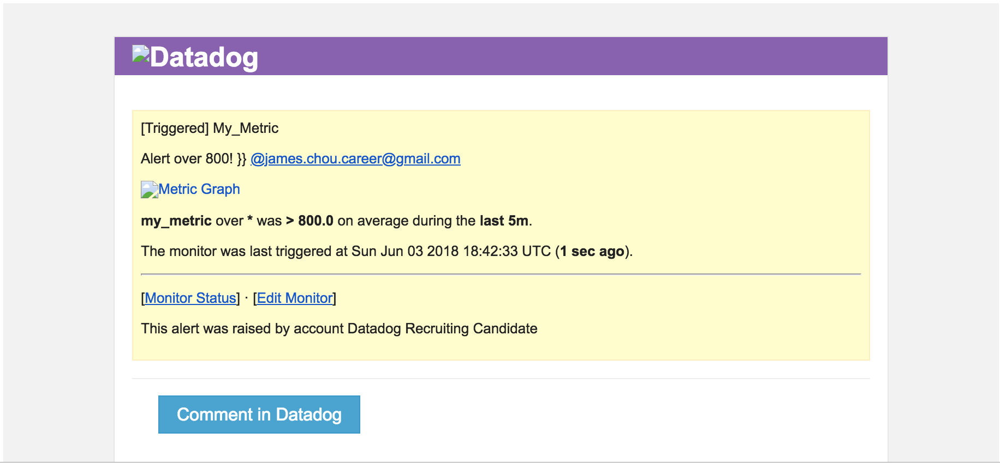

#### Q: Collecting APM Data
  From the documentation I learned that I can send metric data from my applications to my agent which will regularly send the data to the Datadog API.

  1. My first step was to install the trace agent which also requires Go. I installed Go using Homebrew (`brew install go`) and found that the documentation for installing the trace agent was not working for MacOSX.

  Using some guidance from a [related issue on the data-dog-trace-agent github page](https://github.com/DataDog/datadog-trace-agent/issues/397), I could install the trace agent by running the following in the terminal:

  ~~~
  go get github.com/DataDog/datadog-trace-agent/cmd/trace-agent
cd $GOPATH/src/github.com/DataDog/datadog-trace-agent
make install
  ~~~

  __result:__
  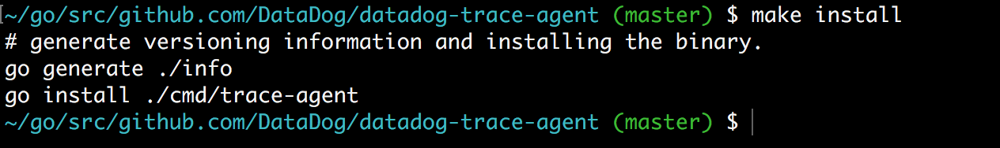

  2. In this exercise I decided to use my rails app, [mini-capstone](https://github.com/jameschou93/mini-capstone). I added `gem 'ddtrace', '~> 0.4.0'` to my `Gemfile` and ran `bundle install` in my terminal.

  The ruby instrumentation also require that I create a `config/initializers/datadog.rb` file with the following code:

  ~~~
  Datadog.configure do |c|
  # This will activate auto-instrumentation for Rails
    c.use :rails
  end
  ~~~
  In my agent directory, I uncommented the `apm config` in `datadog.yaml` as shown:

  ~~~
  apm_config:
    enabled: true
  ~~~

  Once I ran my rails app locally, I ran into this error:
  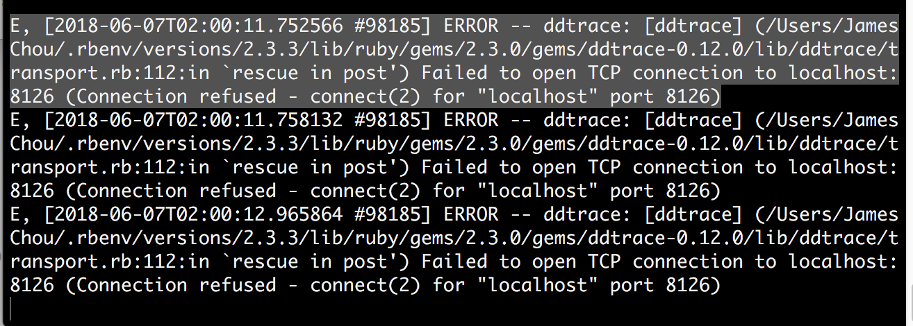

__Troubleshooting__
-----
  1. I restarted my Datadog agent and rails app and noticed that I was receiving an error when starting my agent:
  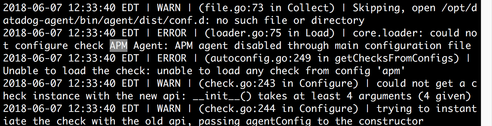

__datadog-agent status__
  ~~~
  Loading Errors
==============
  apm
  ---
    Core Check Loader:
      Could not configure check APM Agent: APM agent disabled through main configuration file
  ~~~

  2. The error stated a connection refused between my agent and my app so I decided to check my agent  configuration file (`datadog.yaml`) first. I set `enabled: false` in `apm_config` and restarted my rails app and the agent. Received the same error in my rails app and agent.

  3. Attempted to try adding different file settings (env: "my-app", receiver_port:m8126, max_traces_per_second: 1). Received the same error.

  4. Github and Datadog docs did not have any related issues.

-----
#### Q:Bonus Question: What is the difference between a Service and a Resource?

A service is a metric that covers a grouping of processes that define a particular functionality (i.e your application, external api, databases) while a resource is a specific query to one of these services.

#### Q: Is there anything creative you would use Datadog for?

The first idea that comes to mind is the use of anomaly monitoring in a large hospital. I think it would be an awesome resource for doctors and patients to be able to view trends in not only their health metrics but how their behaviors and external environments play a part in their personal health. For example, we can see on a larger scale how much average recovery rate in the ICU increases after the introduction of daily musical therapy. On a more individual level, patients recovering from severe bone fractures can be informed of their recovery before and during treatment. 
