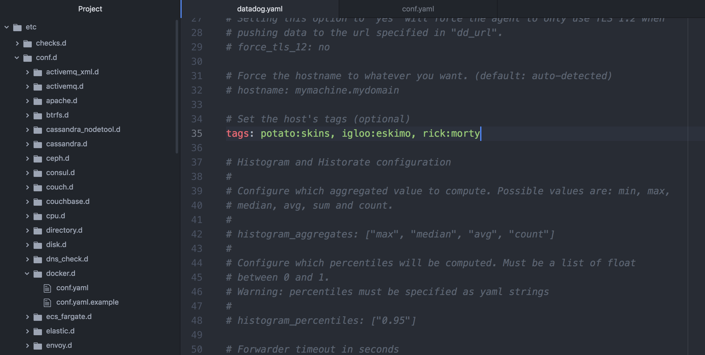
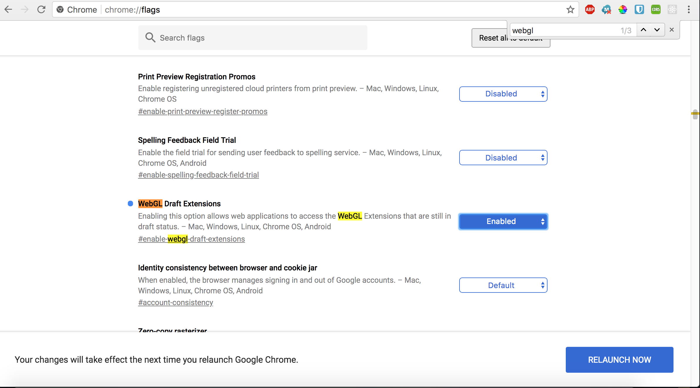
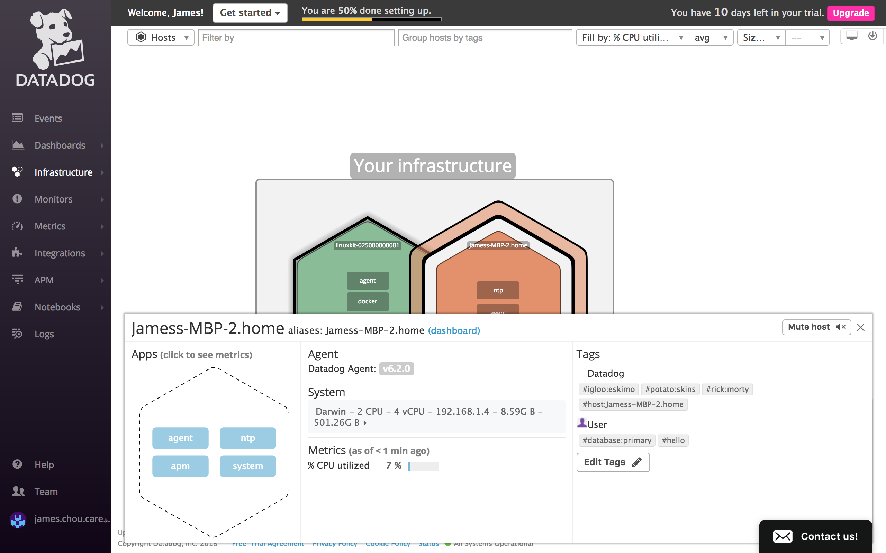
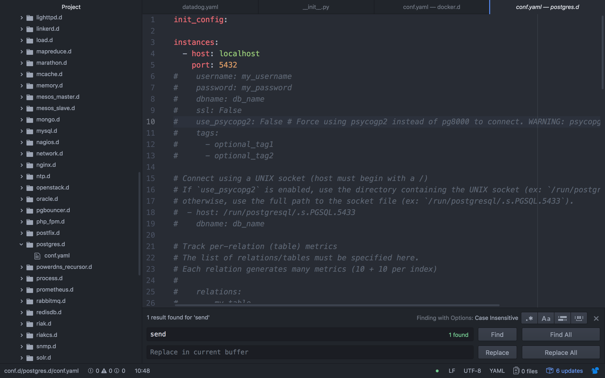

### Add tags in the Agent config file and show us a screenshot of your host and its tags on the Host Map page in Datadog.

There are multiple methods of applying tags to your host including the use of integrations, the Datadog UI, the Datadog API, and your host configuration file. In order to assign a tag using the configuration file you must:

1. Open your datadog.yaml file in your text editor
2. Add tags to your tag dictionary following the required syntax shown in the [Datadog Documentation](https://docs.datadoghq.com/getting_started/tagging/assigning_tags/). Here we are using key:value tags.

3. Reset your Agent from your terminal using the following lines
~~~
datadog-agent restart
~~~

*Before accessing the hostmap, you may be prompted to enable WebGl if you are using Google Chrome. You can enable WebGL by*:

1. Typing [chrome://flags/](chrome://flags/) in the adress bar and hitting enter
2. Click enable under _WebGL Draft Extensions_

On the [host map page](https://app.datadoghq.com/infrastructure/map), you will see the tags assigned to your host by clicking on the hexagon representing your host.

### Install a database on your machine (MongoDB, MySQL, or PostgreSQL) and then install the respective Datadog integration for that database.

For this question I already had PostgreSQL installed through [https://www.enterprisedb.com/downloads/postgres-postgresql-downloads](https://www.enterprisedb.com/downloads/postgres-postgresql-downloads)

The Datadog integration for PostgreSQL is installed along with the agent. You can also find the Postgres config file in

